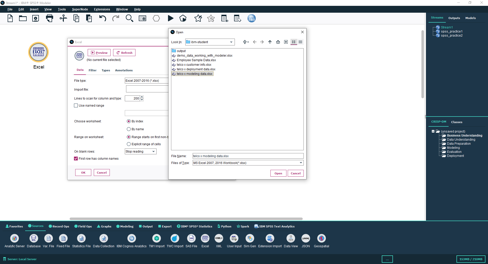
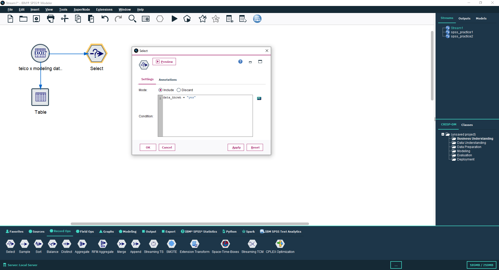
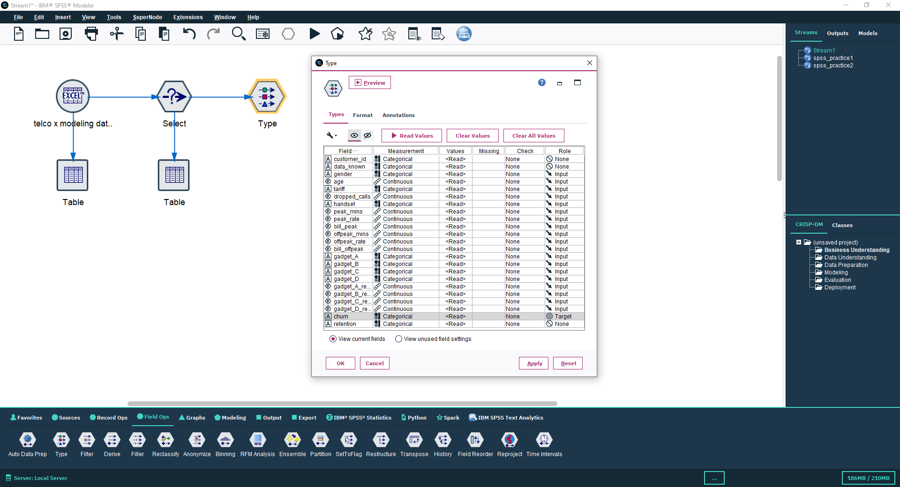
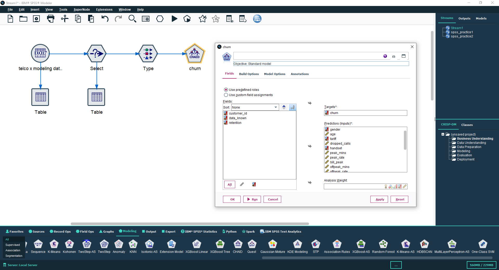
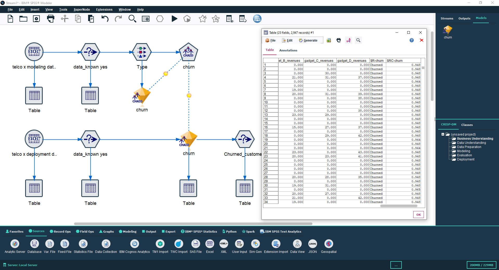
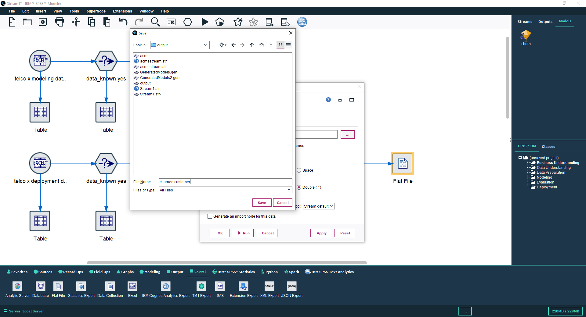

<!-- Banner Section -->

  

<h1 align="center"> Telco Customer Churn Prediction using IBM SPSS Modeler</h1>

  <b>Predictive Analytics Project | IBM SPSS Modeler | CHAID Algorithm</b> 
  
  
  

---

##  Project Overview

This project demonstrates a **Telco Customer Churn Prediction** model built using **IBM SPSS Modeler** as part of a **Predictive Analytics course**.  
The objective was to **train and test a churn prediction model** using Telco datasets and export the results for further analysis.  

The model leverages the **CHAID (Chi-squared Automatic Interaction Detection)** algorithm to identify key factors influencing customer churn and to classify customers based on churn likelihood.

---

##  Objective

> To train a churn prediction model on the **Telco modeling dataset** and test the model on the **Telco deployment dataset**, then export the predicted results.

---

##  Workflow Summary

| Step | Task | Description |
|------|------|--------------|
| 1️⃣ | **Data Import** | Imported Telco dataset using the **Excel node**. |
| 2️⃣ | **Data Filtering** | Used the **Select node** to include only records where `data_known = "yes"`. |
| 3️⃣ | **Data Typing** | Defined measurement levels and roles using the **Type node**. |
| 4️⃣ | **Model Training** | Trained a model using the **CHAID algorithm**. |
| 5️⃣ | **Model Testing** | Tested the model with the **deployment dataset**. |
| 6️⃣ | **Result Selection** | Selected only churned customers with accuracy above `0.94`. |
| 7️⃣ | **Field Filtering** | Used a **Filter node** to keep relevant fields only. |
| 8️⃣ | **Result Export** | Exported the final results using the **Flat File node**. |

---

##  Steps with Screenshots

### 1. Data Import
Imported the dataset using **Excel node** from the source palette.

---

### 2. Data Filtering
Used **Select node** with condition `data_known = "yes"` to include only known data.

---

### 3. Define Field Roles
Connected the **Select node** to a **Type node** and set predictors, target, and measurement levels.

---

### 4. Model Training (CHAID)
Built the model using **CHAID node** and ran the training process.

---

### 5. Model Testing
Tested the model using deployment dataset and evaluated churn predictions.

---

### 6. Export Results
Exported the [output](https://raw.githubusercontent.com/crimsonrewind/Telco_Churn_Prediction_SPSS/main/output/churned_customer) file using the **Flat File node** for final predictions.

---

##  Key Outcomes

- Successfully trained and validated a **CHAID-based churn model**.   
- Identified **key predictors** such as contract type, tenure, and monthly charges.  
- Exported actionable customer churn data for business insights.

---

##  Tools & Technologies

- **IBM SPSS Modeler**
- **CHAID Algorithm**
- **Telco Customer Dataset (Training & Deployment)**

---

##  References

- [IBM SPSS Modeler Documentation](https://www.ibm.com/docs/en/spss-modeler/18.6.0?topic=spss-modeler-v1860-documentation)  
- Predictive Analytics Course Material  
- Telco Churn Dataset (for [modeling](https://raw.githubusercontent.com/crimsonrewind/Telco_Churn_Prediction_SPSS/main/data/telco_deployment_data.xlsx) and [deployment](https://raw.githubusercontent.com/crimsonrewind/Telco_Churn_Prediction_SPSS/main/data/telco_modeling_data.xlsx))

---

##  Author

**Name:** *Ayush Verma*  
**Course:** Predictive Analytics  
**Instructor:** *Mr. Ayushman Bhadauria*  
**Institution:** *BABU BANARASI DAS UNIVERSITY*  
**GitHub:** [@crimsonrewind](https://github.com/crimsonrewind)

---

   <i>“Data is the new oil — predictive analytics is the refinery.”</i>

